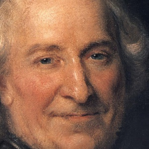
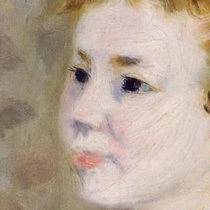
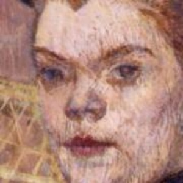
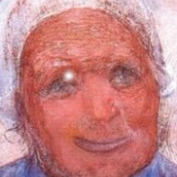
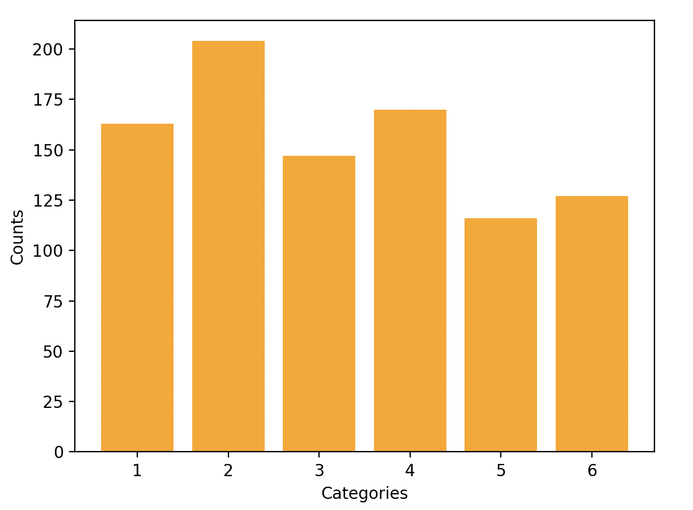

# Margin-Enhanced Logit Normalization Loss

- [Margin-Enhanced Logit Normalization Loss](#margin-enhanced-logit-normalization-loss)
  - [Introduction](#introduction)
  - [Approach](#approach)
  - [Datasets](#datasets)
    - [Portraits](#portraits)
    - [Breast Grading](#breast-grading)
    - [Muscle Age](#muscle-age)
  - [References](#references)

## Introduction

Out-of-distribution (OOD) detection is a critical aspect of deep learning, especially in deploying models for real-world applications. Deep learning models are trained on specific datasets and are often highly specialized in recognizing patterns within the distribution of their training data. However, when presented with inputs that fall outside this distribution, such as novel or anomalous data points, these models may produce unreliable predictions with high confidence, leading to catastrophic outcomes in sensitive domains like healthcare, autonomous driving, and financial systems. Therefore, the ability to accurately identify OOD samples ensures that the system remains robust and dependable by flagging cases that require additional human intervention or alternative processing strategies.

From an academic standpoint, OOD detection also addresses broader challenges in machine learning, such as enhancing generalization and mitigating overfitting. Robust detection mechanisms facilitate the safe deployment of models in dynamic environments where the data encountered can vary significantly from the training set. Furthermore, the integration of OOD detection frameworks allows researchers to explore the boundaries of a model's epistemic uncertainty, which is crucial for developing models with calibrated confidence levels. This not only promotes transparency and interpretability in machine learning systems but also aligns with the ethical imperative to mitigate potential risks associated with automation and decision-making in AI-driven technologies.

## Approach

$$
L_{MultiClassHinge}[\frac{logits}{(|logits + ReLU(\theta)|_2 + \epsilon)} * \phi, targets]
$$

<br />

## Datasets

The dataset used for this research training was the portraits dataset provided by [Dr. Nanni](https://scholar.google.it/citations?user=5NSGzcQAAAAJ&hl=en) to make sure the comparison between already implemented approaches and the new ideas is solid since he could instantly compare newly achieved performance metrics with the prior.

### Portraits

<div align="center">
    
    
    
</div>

<div align="center">
    
    
    
</div>

<div align="center">
    
    
    
</div>

<br />

The dataset consists of a total of 927 images, meticulously categorized into six distinct groups. The figure provides a visual representation of the distribution of images across these categories, offering insights into the dataset's composition.

<div align="center">
    
</div>

### Breast Grading

### Muscle Age

## References

```bibtex
@article{wei2022logitnorm,
    title={Mitigating Neural Network Overconfidence with Logit Normalization},
    author={Wei, Hongxin and Xie, Renchunzi and Cheng, Hao and Feng, Lei and An, Bo and Li, Yixuan},
    booktitle={International Conference on Machine Learning (ICML)},
    year={2022}
}
```
